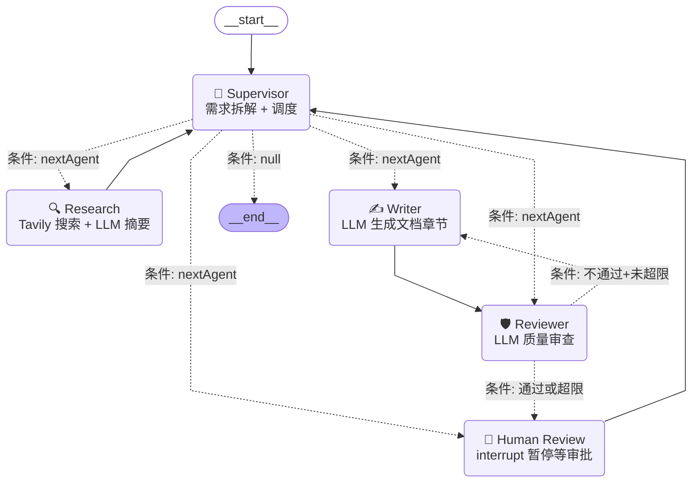

# Agent 状态图

> 由 `npx tsx src/agent/visualize.ts` 生成，可在 GitHub / Mermaid Live 查看

## Mermaid 图



## 状态流转

```
START
  │
  ▼
┌──────────┐    ┌──────────┐    ┌──────────┐    ┌──────────┐    ┌──────────┐
│Supervisor│───→│ Research │───→│Supervisor│───→│  Writer  │───→│ Reviewer │
│ 拆解任务 │    │ 竞品搜索 │    │ 调度写文档│    │ 生成文档 │    │ 质量审查 │
└──────────┘    └──────────┘    └──────────┘    └──────────┘    └─────┬────┘
                                             ▲                        │
                                             │     ┌──────────────────┤
                                             │     │ 通过 / 超限       │ 不通过+未超限
                                             │     ▼                  │
                                             │ ┌──────────┐          │
                                             │ │  Human   │          │
                                             │ │ Review   │◄─────────┘
                                             │ │ interrupt│
                                             │ └────┬─────┘
                                             │      │
                                             │      │ approve / modify / rewrite
                                             │      ▼
                                             └─────┘ (回到 Supervisor)
```

## 路由规则

| 路由 | 条件 | 目标 |
|------|------|------|
| supervisorRouter | `nextAgent === "research"` | Research |
| | `nextAgent === "writer"` | Writer |
| | `nextAgent === "reviewer"` | Reviewer |
| | `nextAgent === "human"` | Human Review |
| | 其他 | END |
| reviewerRouter | `reviewPassed === true` | Human Review |
| | `rewriteAttempts >= maxRewriteAttempts` | Human Review (强制人工) |
| | 其他 (不通过但未超限) | Writer (重写) |
